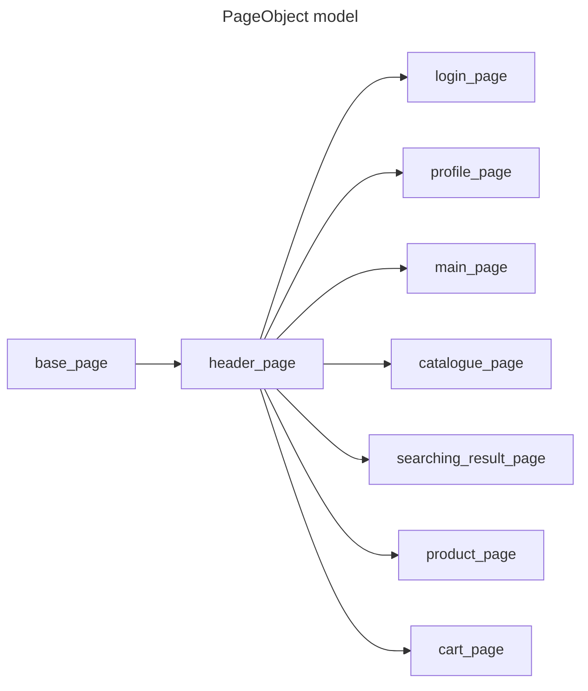

# Проект по автоматизированному тестированию онлай магазина quke.ru

## Описание
Данный проект предназначен для автоматизации тестирования веб-приложений с использованием библиотеки Selenium 
и языка программирования Python. Тесты помогают обеспечить качество и стабильность 
веб-приложений при внесении изменений в код.

## Версии ПО и библиотек
Python 3.11\
allure-pytest         2.13.5\
allure-python-commons 2.13.5\
attrs                 24.2.0\
beautifulsoup4        4.12.3\
certifi               2024.8.30\
charset-normalizer    3.4.0\
h11                   0.14.0\
idna                  3.10\
iniconfig             2.0.0\
lxml                  5.3.0\
outcome               1.3.0.post0\
packaging             24.1\
pip                   24.3.1\
pluggy                1.5.0\
PySocks               1.7.1\
pytest                8.3.3\
pytest-rerunfailures  14.0\
requests              2.32.3\
selenium              4.25.0\
setuptools            68.2.0\
sniffio               1.3.1\
sortedcontainers      2.4.0\
soupsieve             2.6\
trio                  0.26.2\
trio-websocket        0.11.1\
typing_extensions     4.12.2\
urllib3               2.2.3\
websocket-client      1.8.0\
wheel                 0.41.2\
wsproto               1.2.0\

## Драйверы
chromedriver (Browser Chrome)\
geckodriver (Browser Firefox)

## Структура проекта
+ :file_folder: **OnlineStore** *# Репозиторий*
  + :file_folder: **elements** *# Элементы интерфейса*
    + :page_facing_up: **base_elements** *# Универсальные (кнопка, инпут и т.д.)*
  + :file_folder: **locators** *# Локаторы на страницах*
  + :file_folder: **pages** *# Методы взаимодействия и условия проверок*
  + :file_folder: **tests** *# Тесты*
    + :page_facing_up: **test_cart_page** *# Тесты страницы Корзина*
    + :page_facing_up: **test_login_page** *# Тесты страницы авторизации*
    + :page_facing_up: **test_main_page** *# Тесты страницы Главная*
    + :page_facing_up: **test_profile_page** *# Тесты страницы профиля*
  + :file_folder: **utils** *# Вспомогательные методы*
    + :page_facing_up: **api_features** *# Методы взаимодействия с API*
    + :page_facing_up: **data_for_api** *# Тестовые данные для API*
    + :page_facing_up: **data** *# Тестовые данные (общие)*
  + :page_facing_up: **conftest** *# Конфигурация тестов, фикстуры*
  + :page_facing_up: **pytest.ini** *# Файл конфигурации Pytest*
  + :page_facing_up: **requirements.txt** *# Зависимости*

### Схема проектирования

