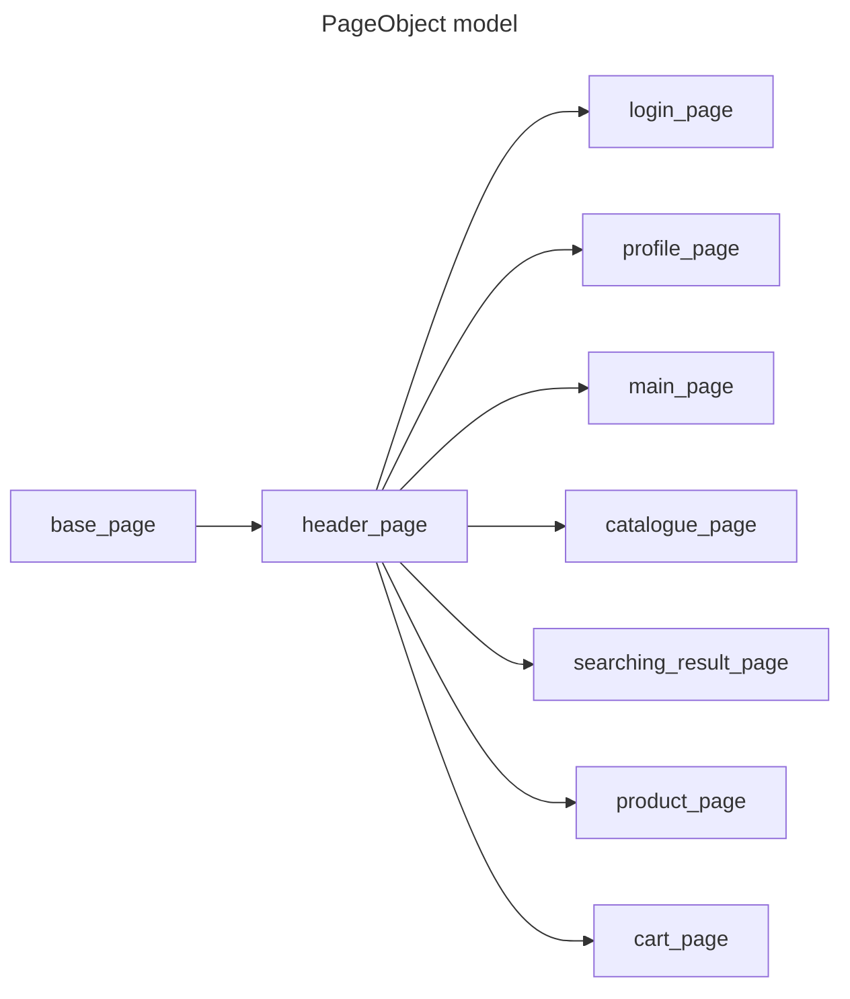

# Проект по автоматизированному тестированию онлайн магазина quke.ru

___
## Описание

Данный проект предназначен для автоматизации тестирования веб-приложений с использованием библиотеки Selenium 
и языка программирования Python. Тесты помогают обеспечить качество и стабильность 
веб-приложений при внесении изменений в код.
___

## Версии ПО и библиотек

Python 3.11\
allure-pytest         2.13.5\
allure-python-commons 2.13.5\
attrs                 24.2.0\
beautifulsoup4        4.12.3\
certifi               2024.8.30\
charset-normalizer    3.4.0\
h11                   0.14.0\
idna                  3.10\
iniconfig             2.0.0\
lxml                  5.3.0\
outcome               1.3.0.post0\
packaging             24.1\
pip                   24.3.1\
pluggy                1.5.0\
PySocks               1.7.1\
pytest                8.3.3\
pytest-rerunfailures  14.0\
requests              2.32.3\
selenium              4.25.0\
setuptools            68.2.0\
sniffio               1.3.1\
sortedcontainers      2.4.0\
soupsieve             2.6\
trio                  0.26.2\
trio-websocket        0.11.1\
typing_extensions     4.12.2\
urllib3               2.2.3\
websocket-client      1.8.0\
wheel                 0.41.2\
wsproto               1.2.0\
___

## Драйверы

chromedriver (Browser Chrome)\
geckodriver (Browser Firefox)
___

## Структура проекта

+ :file_folder: **OnlineStore** *# Репозиторий*
  + :file_folder: **elements** *# Элементы интерфейса*
    + :page_facing_up: **base_elements** *# Универсальные (кнопка, инпут и т.д.)*
  + :file_folder: **locators** *# Локаторы на страницах*
  + :file_folder: **pages** *# Методы взаимодействия и условия проверок*
  + :file_folder: **tests** *# Тесты*
    + :page_facing_up: **test_cart_page** *# Тесты страницы Корзина*
    + :page_facing_up: **test_login_page** *# Тесты страницы авторизации*
    + :page_facing_up: **test_main_page** *# Тесты страницы Главная*
    + :page_facing_up: **test_profile_page** *# Тесты страницы профиля*
  + :file_folder: **utils** *# Вспомогательные методы*
    + :page_facing_up: **api_features** *# Методы взаимодействия с API*
    + :page_facing_up: **data_for_api** *# Тестовые данные для API*
    + :page_facing_up: **data** *# Тестовые данные (общие)*
  + :page_facing_up: **conftest** *# Конфигурация тестов, фикстуры*
  + :page_facing_up: **pytest.ini** *# Файл конфигурации Pytest*
  + :page_facing_up: **requirements.txt** *# Зависимости*
___

### Схема проектирования


___

## Установка

1. Склонировать репозиторий\
```git clone https://github.com/shmurge/onlineStore.git```
2. Перейти в репозиторий\
```cd OnlineStore```
3. Установка зависимостей\
```pip install -r requirements.txt```
4. Установка драйверов
+ chromedriver

> Шаг 1: Убедитесь, что у вас установлен Google Chrome.
Прежде всего, необходимо проверить версию Google Chrome. Чтобы сделать это, откройте браузер и зайдите в меню, выбрав «Справка» -> «О Google Chrome». Здесь вы увидите текущую версию браузера.

> Шаг 2: Скачайте соответствующую версию ChromeDriver
Перейдите на https://chromedriver.chromium.org/downloads.
Найдите версию ChromeDriver, которая соответствует версии вашего Google Chrome. Обычно это самая новая версия, но лучше всего свериться с номером сборки.
Скачайте архив с ChromeDriver для вашей операционной системы (Windows, macOS или Linux).

> Шаг 3: Распаковка ChromeDriver
Если вы скачали ZIP-архив, распакуйте его в удобное для вас место. Например, вы можете распаковать его в папку C:\chromedriver на Windows или в /usr/local/bin/ на Linux или macOS.

> Шаг 4: Настройка системного PATH (опционально)
Если вы хотите, чтобы ChromeDriver был доступен из командной строки без указания полного пути, вам нужно добавить его в переменную окружения PATH:\
Windows:\
Кликните правой кнопкой мыши на «Этот компьютер» или «Компьютер» на рабочем столе и выберите «Свойства».
Нажмите на «Дополнительные параметры системы».
В диалоговом окне выберите кнопку «Переменные среды».
В разделе «Системные переменные» найдите переменную Path и выберите «Изменить».
Добавьте путь к папке, где находится chromedriver.exe (например, C:\chromedriver). Нажмите OK, чтобы закрыть все окна.\
macOS и Linux:\
Откройте терминал и выполните следующую команду, чтобы переместить ChromeDriver в /usr/local/bin/, что добавит его в PATH:\
sudo mv /path/to/chromedriver /usr/local/bin/\
Замените /path/to/chromedriver на фактический путь к файлу.

> Шаг 5: Проверка установки\
Чтобы убедиться, что chromedriver установлен корректно, откройте командную строку (или терминал) и введите:\
chromedriver --version\
Если вы видите версию chromedriver, значит, установка прошла успешно!

+ geckodriver (firefox)
> Шаг 1: Убедитесь, что у вас установлен Mozilla Firefox.
Прежде чем устанавливать GeckoDriver, проверьте версию Firefox. Чтобы проверить версию браузера, откройте его и перейдите в меню, выбрав «Справка» -> «О Firefox». Здесь вы увидите текущую версию браузера.

>Шаг 2: Скачайте GeckoDriver
Перейдите на https://github.com/mozilla/geckodriver/releases.
Найдите последнюю версию GeckoDriver. Убедитесь, что версия GeckoDriver соответствует версии вашего браузера Firefox.
Выберите нужный архив для вашей операционной системы (Windows, macOS или Linux).

>Шаг 3: Распаковка GeckoDriver
Если вы скачали ZIP-архив, распакуйте его в удобное для вас место. Например, вы можете распаковать его в папку C:\geckodriver на Windows или в /usr/local/bin/ на Linux или macOS.

>Шаг 4: Настройка системного PATH (опционально)
Чтобы использовать GeckoDriver из командной строки без указания полного пути, добавьте его в переменную окружения PATH:\
Windows:\
Кликните правой кнопкой мыши на «Этот компьютер» или «Компьютер» на рабочем столе и выберите «Свойства».
Нажмите на «Дополнительные параметры системы».
В диалоговом окне выберите кнопку «Переменные среды».
В нижней части окна найдите переменную Path, выберите ее и нажмите «Изменить».
Нажмите «Создать» и добавьте путь к папке, где находится geckodriver.exe, например, C:\geckodriver.
Нажмите «OK», чтобы сохранить изменения.\
Linux/macOS:\
Откройте терминал.
macOS и Linux:\
Откройте терминал и выполните следующую команду, чтобы переместить geckodriver в /usr/local/bin/, что добавит его в PATH:\
sudo mv /path/to/geckodriver /usr/local/bin/\
Замените /path/to/geckodriver на фактический путь к файлу.

> Шаг 5: Проверка установки\
После установки GeckoDriver проверьте, что он правильно установлен, запустив команду в терминале или командной строке:\
geckodriver --version\
Если установка прошла успешно, вы увидите установленную версию geckodriver.

Теперь вы готовы использовать GeckoDriver с Selenium для автоматизации браузера Firefox!

## Запуск тестов
```cd tests```
+ Для запуска в браузере chrome (по умолчанию установлен chrome)\
```pytest -v -s --tb=line --reruns=3 --headless --alluredir allure_report```\
где reruns - количество перезапусков теста в случае падения\
--headless фоновый режим работы браузера (для запуска в обычном режиме уберите параметр --headless)
--alluredir allure_report создает директорию allure_report в корне проекта с отчетом по прогону
+ Для запуска в браузере firefox\
```pytest -v -s --tb=line --reruns=3 --browser=firefox --headless --alluredir allure_report```
+ Для запуска тестов с предусловием логина используйте параметры --login -m=may_be_login
```pytest -v -s --tb=line --reruns=3 --headless --login -m=may_be_login --alluredir allure_report```\
или\
```pytest -v -s --tb=line --reruns=3 --browser=firefox --headless --login -m=may_be_login --alluredir allure_report```
+ Для запуска отчета по прогону
```allure serve allure_report```\
после перейдите в браузер (если редирект не произошел автоматически)\
перед следующим прогоном рекомендуется очистить директорию allure_report